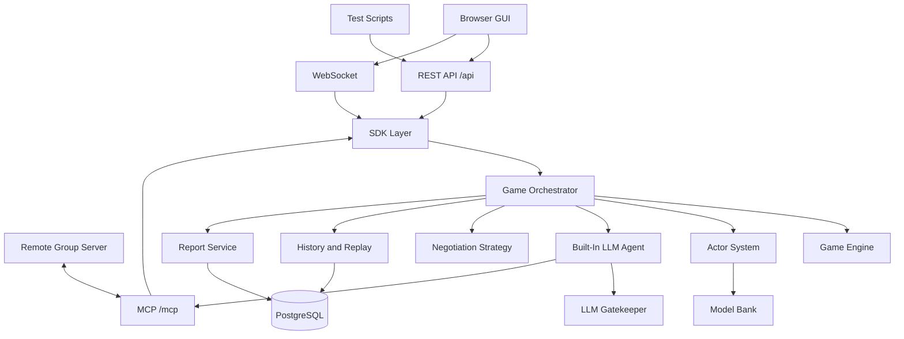

# Plan — Final Project Implementation

> **Document type:** General Engineering Plan  
> **Scope:** High-level architecture, stack, directory order, and development sequence.

---

## 1. Recommended Stack

| Layer | Choice |
|---|---|
| Backend | Python FastAPI |
| Frontend | Next.js + React + TypeScript |
| Styling | Tailwind CSS + component library |
| Database | PostgreSQL |
| Local DB | PostgreSQL in Docker or SQLite for quick tests |
| ORM | SQLAlchemy + Alembic |
| Realtime | WebSocket |
| MCP | Streamable HTTP endpoint under `/mcp` |
| Background jobs | FastAPI tasks for MVP, Redis worker later |
| RL training | Python training package, offline jobs |
| Package manager | `uv` |
| Testing | pytest, httpx, Playwright |
| Deployment | Docker Compose |

---

## 2. Target Repository Layout

```text
project-root/
  README.md
  pyproject.toml
  uv.lock
  config/
    setup.json
    game_defaults.json
    rate_limits.json
    official_rule_presets.json
  docs/
    PRD.md
    plan.md
    game_rules.md
    development_rules.md
    PRD_game_engine.md
    plan_game_engine.md
    PRD_webserver.md
    plan_webserver.md
    PRD_rest_api.md
    plan_rest_api.md
    PRD_mcp_intergroup.md
    plan_mcp_intergroup.md
    PRD_actor.md
    plan_actor.md
    PRD_llm_agent.md
    plan_llm_agent.md
    PRD_negotiation.md
    plan_negotiation.md
    PRD_replay_history.md
    plan_replay_history.md
    PRD_email_report.md
    plan_email_report.md
    TODO.md
    cost.md
  src/cop_thief/
    sdk/
      sdk.py
    shared/
      version.py
      gatekeeper.py
      security.py
      errors.py
    game_engine/
    webserver/
    api/
    mcp/
    actors/
    agents/
    negotiation/
    reports/
    email/
    replay/
    history/
    db/
  frontend/
  tests/
    unit/
    integration/
    api_flows/
    e2e/
  notebooks/
  assets/
  models/
```

---

## 3. Runtime Architecture



---

## 4. Development Sequence

### Phase 1 — Foundation

- Create project layout.
- Add config files.
- Add SDK layer.
- Add development rules.
- Add base database models.

### Phase 2 — Game Engine

- Implement deterministic rules engine.
- Implement observation filtering.
- Implement state hashing and replay.
- Add unit/integration tests.

### Phase 3 — Actor System

- Implement RandomLegalActor and heuristic actors.
- Implement Model Bank metadata and selection.
- Add action-mask integration.

### Phase 4 — REST and Web UI

- Implement `/api` endpoints.
- Build GUI pages.
- Ensure every GUI operation has API parity.
- Add WebSocket live updates.

### Phase 5 — MCP Inter-Group Play

- Implement MCP server tools.
- Implement MCP client.
- Add fake remote server tests.
- Run local server-vs-server match.

### Phase 6 — Built-In LLM Agent

- Implement Gatekeeper.
- Implement message generation.
- Implement negotiation message generation.
- Ensure hidden-state filtering.

### Phase 7 — Negotiation Strategy

- Implement rule-based negotiation.
- Add performance table selection.
- Add contextual bandit later.

### Phase 8 — Reports and Email

- Generate JSON reports.
- Expose report API.
- Add configurable email delivery.
- Scan docs/config for hard-coded recipient addresses.

### Phase 9 — Neural Training

- Implement RL environment wrapper.
- Train/evaluate PPO or recurrent PPO actors offline.
- Register model artifacts in Model Bank.

---

## 5. Security Rules

- No hard-coded secrets.
- No hard-coded recipient email addresses.
- All LLM calls through Gatekeeper.
- External MCP URLs must be validated.
- Guest MCP users cannot trigger outbound calls.
- Hidden live-game state must not leak through UI, API, MCP, logs, or LLM prompts.

---

## 6. Testing Strategy

- Unit tests for rules and pure modules.
- Integration tests for full matches.
- API flow tests for every GUI operation.
- MCP compatibility tests with fake remote server.
- Hidden-state leakage tests.
- Report schema tests.
- Email disabled/dry-run tests.
- E2E browser tests for core pages.

---

## 7. Documentation Rule

Each major component must have:

```text
PRD_<component>.md
plan_<component>.md
```

PRD files define what the component must do. Plan files define how to build it.
