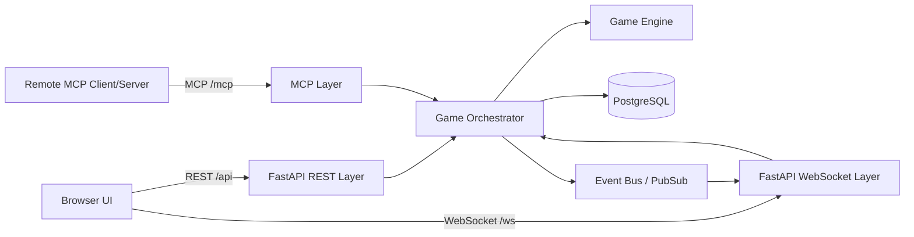
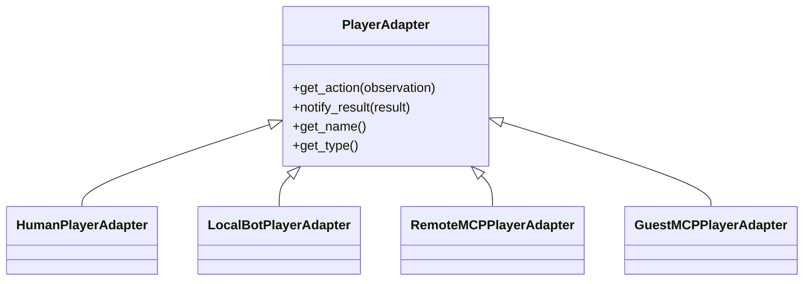
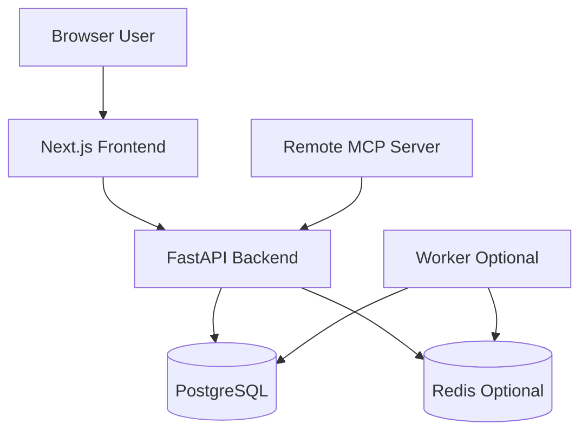

# Plan — Cop & Thief Web Server

> **Document type:** Engineering / implementation plan  
> **Scope:** How to build the web server: stack, architecture, modules, diagrams, endpoints, storage, deployment, and milestones.  
> **Related documents:** `PRD_webserver.md`, `game_rules_fixed.md`, `PRD_game_engine_updated.md`  
> **Status:** Draft v1

---

## 1. Stack Decision

Recommended stack:

| Layer | Choice | Reason |
|---|---|---|
| Backend | Python FastAPI | Python-native, good API validation, async support, WebSocket support, easy integration with game engine |
| Frontend | Next.js + React + TypeScript | Strong UI ecosystem, responsive app, good routing, good developer experience |
| Styling | Tailwind CSS + component library such as shadcn/ui | Fast polished UI, responsive layouts |
| Database | PostgreSQL | Reliable persistence for games, events, users, replay data |
| Local development DB | SQLite or PostgreSQL in Docker | Fast setup; PostgreSQL preferred if possible |
| ORM / migrations | SQLAlchemy + Alembic | Standard Python database stack |
| Realtime | WebSocket | Bidirectional live game updates and human action flow |
| MCP | MCP Streamable HTTP endpoint under `/mcp` | Supports MCP clients and remote game servers over HTTP |
| Background jobs | FastAPI background tasks for MVP; Redis + RQ/Celery/Arq for production | Needed for server-vs-server games and bot turns |
| Testing | pytest, httpx, Playwright | Backend unit/integration tests plus browser UI tests |
| Deployment | Docker Compose | Simple local and server deployment |

Official references:

- FastAPI: https://fastapi.tiangolo.com/
- FastAPI WebSockets: https://fastapi.tiangolo.com/advanced/websockets/
- MCP Streamable HTTP transport: https://modelcontextprotocol.io/specification/2025-11-25/basic/transports

---

## 2. Key Architectural Decision

Use REST/WebSocket for the human browser UI and MCP for server/agent interaction.

Do **not** make the browser talk directly to MCP in the first version.

Reason:

- REST is simpler for browser authentication, sessions, CSRF, pagination, and normal UI workflows.
- WebSocket is simpler for live human game updates.
- MCP is better for agent/server-to-server interaction.
- Both REST and MCP should call the same internal game orchestration service, so game logic is not duplicated.

Recommended flow:



---

## 3. Backend Module Layout

Suggested backend package structure:

```text
backend/
  app/
    main.py
    config.py
    api/
      routes_auth.py
      routes_games.py
      routes_replay.py
      routes_admin.py
      websocket_games.py
    mcp/
      server.py
      tools.py
      client.py
      schemas.py
    core/
      auth.py
      security.py
      permissions.py
      rate_limits.py
    game/
      engine_adapter.py
      orchestrator.py
      player_adapters.py
      bot_strategy.py
      replay_builder.py
      state_hash.py
    db/
      models.py
      session.py
      repositories.py
      migrations/
    schemas/
      api.py
      game.py
      replay.py
    tests/
```

Important rule:

```text
Game mechanics live in the game engine.
The web server orchestrates, stores, displays, and exposes the game.
```

---

## 4. Frontend Module Layout

Suggested frontend package structure:

```text
frontend/
  app/
    page.tsx
    login/page.tsx
    games/page.tsx
    games/[gameId]/page.tsx
    games/[gameId]/replay/page.tsx
    games/new/page.tsx
    live/[gameId]/page.tsx
  components/
    Board/
      GameBoard.tsx
      Cell.tsx
      Piece.tsx
      Barrier.tsx
      Crumbtrail.tsx
    Replay/
      ReplayControls.tsx
      ReplayTimeline.tsx
      ReplayFrameInfo.tsx
    Games/
      GameHistoryTable.tsx
      GameSummaryCard.tsx
      SubGameTable.tsx
    LiveGame/
      ActionPanel.tsx
      MovePad.tsx
      BarrierPlacementPanel.tsx
      TurnStatus.tsx
    Layout/
      Header.tsx
      Sidebar.tsx
      ResponsiveContainer.tsx
  lib/
    apiClient.ts
    websocketClient.ts
    types.ts
```

---

## 5. System Components

## 5.1 FastAPI REST Layer

Responsibilities:

- expose `/api` endpoints;
- handle browser authentication;
- validate request bodies;
- call the game orchestrator;
- return game/history/replay data;
- enforce permissions.

The REST layer must not implement game mechanics.

## 5.2 WebSocket Layer

Responsibilities:

- maintain live browser connections;
- push game state updates;
- receive human player actions if using WebSocket for actions;
- notify clients when games/sub-games end;
- handle reconnects.

For the MVP, actions can be submitted through REST and state updates sent through WebSocket. Later, actions may also be sent through WebSocket.

## 5.3 MCP Layer

Responsibilities:

- expose MCP tools under `/mcp`;
- allow remote MCP clients to start guest games against this server;
- allow remote MCP game servers to accept proposed matches;
- return observations;
- accept actions;
- expose public history/replay resources if desired;
- implement MCP client logic for initiating outbound matches against other servers.

The server must be both:

```text
MCP server: receives calls at /mcp
MCP client: calls other servers' /mcp endpoints
```

## 5.4 Game Orchestrator

Responsibilities:

- create games/matches;
- create sub-games;
- assign roles;
- connect players/adapters;
- call the game engine;
- enforce turn order;
- request/receive actions;
- persist events;
- publish realtime updates;
- mark games completed/voided/aborted;
- calculate local server result.

## 5.5 Player Adapters

Use adapters so the orchestrator can treat humans, bots, and MCP opponents uniformly.



## 5.6 Persistence Layer

Responsibilities:

- store games;
- store sub-games;
- store events/actions;
- store replay frames or enough data to build them;
- store users;
- store technical failures;
- support pagination and filtering.

---

## 6. Data Model Plan

## 6.1 Tables

Recommended tables:

```text
users
servers
matches
sub_games
game_events
replay_frames
mcp_sessions
technical_failures
```

## 6.2 `users`

Fields:

```text
id
username
display_name
password_hash or external_auth_id
role: user/admin
created_at
last_login_at
is_active
```

## 6.3 `matches`

Fields:

```text
id
public_id
mode: human_vs_server / server_vs_server / guest_mcp_vs_server
status: live / completed / technical_invalid / aborted / cancelled
local_server_name
opponent_name
initiator_user_id nullable
created_at
started_at
ended_at
rules_version
config_json
local_score
opponent_score
result_for_local_server: won / lost / tied / voided / aborted
valid_subgame_count
```

## 6.4 `sub_games`

Fields:

```text
id
match_id
index
status
local_role
opponent_role
winner_role
winner_side: local / opponent / none
win_reason
thief_actions
turn_count
barriers_used
started_at
ended_at
initial_state_json
final_state_json
```

## 6.5 `game_events`

Fields:

```text
id
match_id
sub_game_id
turn_index
actor_role
actor_side
message_text nullable
action_json
result
state_before_json
state_after_json
state_hash
created_at
```

## 6.6 `replay_frames`

Optional cache table.

Fields:

```text
id
match_id
sub_game_id
frame_index
turn_index
board_json
action_summary
visible_state_json nullable
created_at
```

Replay frames can be generated from `game_events` instead of stored. For MVP, storing full `state_after_json` in each event is enough.

---

## 7. REST API Plan

All REST endpoints are under `/api`.

## 7.1 Public Endpoints

```http
GET /api/games
GET /api/games/{match_id}
GET /api/games/{match_id}/subgames
GET /api/games/{match_id}/subgames/{subgame_id}
GET /api/games/{match_id}/subgames/{subgame_id}/replay
GET /api/games/{match_id}/events
```

## 7.2 Auth Endpoints

```http
POST /api/auth/login
POST /api/auth/logout
GET  /api/me
```

## 7.3 Authenticated Game Endpoints

```http
POST /api/games/human-vs-server
POST /api/games/server-vs-server
POST /api/games/{match_id}/human-action
POST /api/games/{match_id}/cancel
```

## 7.4 Optional Admin Endpoints

```http
GET  /api/admin/technical-failures
GET  /api/admin/state-divergences
POST /api/admin/games/{match_id}/void
POST /api/admin/config
```

---

## 8. MCP API Plan

All MCP traffic is served under `/mcp`.

## 8.1 MCP Tools

Recommended tools:

```text
list_supported_rules
start_game_vs_server
propose_match
accept_match
get_observation
submit_action
get_game_status
get_game_history
get_replay
cancel_game
```

## 8.2 `list_supported_rules`

Purpose:

- allow another MCP server/client to understand this server's supported game rules and configuration.

Returns:

```json
{
  "server_name": "cop-thief-server-a",
  "rules_version": "1.0",
  "supported_modes": ["guest_mcp_vs_server", "server_vs_server"],
  "supported_config": {},
  "mcp_protocol_version": "..."
}
```

## 8.3 `start_game_vs_server`

Used by guest MCP clients to start a game against this server.

Guest clients are not allowed to use this tool to make this server connect to a third-party server.

## 8.4 `propose_match`

Used by another server to propose a server-vs-server match.

The proposal should include:

```json
{
  "opponent_name": "server-b",
  "rules_version": "1.0",
  "requested_config": {},
  "role_schedule": []
}
```

## 8.5 `get_observation`

Returns only the observation allowed for the requesting player.

Under partial observation, this must not return hidden opponent position, hidden barriers, or true legal moves that reveal hidden barriers.

## 8.6 `submit_action`

Submits one game action.

Supported action types:

```text
move
stay
barrier
forfeit
```

The MCP layer should return a neutral action result, not hidden-state explanations.

---

## 9. Realtime Event Plan

Use WebSocket endpoint:

```text
/ws/games/{match_id}
```

Possible event messages:

```text
game.started
subgame.started
turn.started
action.submitted
action.applied
action.rejected
game.state_updated
subgame.completed
match.completed
match.voided
connection.status
```

Example event:

```json
{
  "type": "game.state_updated",
  "match_id": "match_123",
  "sub_game_id": "sub_1",
  "turn": 7,
  "payload": {
    "actor": "thief",
    "result": "moved",
    "observation": {}
  }
}
```

---

## 10. Page-by-Page UI Plan

## 10.1 Home

Components:

- header;
- server status card;
- recent games card/table;
- start-game CTA for logged-in users;
- login/logout controls.

## 10.2 History

Desktop layout:

- filter bar on top;
- table of games;
- pagination.

Mobile layout:

- filters collapsed;
- game cards instead of wide table.

## 10.3 Game Detail

Layout:

```text
Game summary header
Score panel
Participants panel
Config accordion
Sub-game table
Replay links
Event/error section if technical invalid
```

## 10.4 Replay

Desktop layout:

```text
+----------------------+----------------------+
| Board                | Turn timeline        |
|                      | Event details        |
+----------------------+----------------------+
| Replay controls                              |
+----------------------------------------------+
```

Mobile layout:

```text
Board
Replay controls
Turn timeline
Event details
```

## 10.5 Live Game

Layout:

```text
Board
Turn status
Action panel
Visible event log
Score/sub-game progress
Connection status
```

---

## 11. Replay Implementation Plan

Replay source of truth:

- Use `game_events` as the canonical log.
- Each event stores `state_before_json` and `state_after_json` for simple replay.
- `replay_frames` may be generated/cached for faster frontend loading.

Replay frame format:

```json
{
  "frame_index": 7,
  "turn": 7,
  "actor": "thief",
  "action": {"type": "move", "direction": "NE"},
  "result": "moved",
  "board": {
    "cop": [1, 1],
    "thief": [3, 4],
    "barriers": [[0, 0], [4, 4]],
    "crumbtrails": []
  },
  "summary": "Thief moved NE from [2,3] to [3,4]"
}
```

Frontend replay state machine:

```text
loaded frames
current_frame_index
is_playing
playback_speed
selected_subgame
```

---

## 12. Security Plan

## 12.1 Authentication

MVP:

- username/password login;
- password hashes stored server-side;
- HTTP-only secure session cookie;
- CSRF protection for unsafe REST actions.

Alternative later:

- OAuth provider;
- magic links;
- SSO.

## 12.2 Guest MCP Rate Limiting

Limit by:

- source IP;
- active game count;
- games per time window;
- maximum turn count/time per game.

## 12.3 SSRF Protection for External MCP URLs

When authenticated users initiate external server games, validate the URL.

Rules:

- require HTTP/HTTPS scheme;
- block localhost and loopback addresses;
- block private network ranges unless explicitly allowed;
- block link-local and metadata-service IPs;
- optionally require an allowlist;
- resolve DNS and re-check IP before connecting;
- set outbound request timeout.

## 12.4 Hidden-State Protection

Rules:

- live public pages must not show hidden true state;
- human active games must show only that player's observation;
- MCP observations must be scoped to the caller;
- completed replays may show full state, clearly labeled.

---

## 13. Background Execution Plan

## 13.1 MVP

Use FastAPI background tasks or asyncio tasks for:

- local bot turns;
- server-vs-server match progression;
- replay frame generation.

## 13.2 Production

Move long-running tasks to a worker system:

```text
FastAPI API Server
  -> Redis Queue
  -> Worker Process
  -> PostgreSQL
  -> WebSocket notifications
```

Recommended options:

- RQ for simple jobs;
- Arq for async Python;
- Celery for more mature distributed tasks.

---

## 14. Deployment Plan

Use Docker Compose.

Services:

```text
frontend
backend
postgres
redis optional
worker optional
```

Example deployment diagram:



Expose:

```text
/: frontend
/api: backend REST
/ws: backend WebSocket
/mcp: backend MCP
```

In production, use a reverse proxy such as Nginx, Traefik, or Caddy.

---

## 15. Development Milestones

## Milestone 1 — Backend skeleton

Deliver:

- FastAPI app;
- `/api/health`;
- database connection;
- migrations;
- basic game/history models.

## Milestone 2 — Game engine integration

Deliver:

- game orchestrator;
- local game creation;
- event persistence;
- completed game storage;
- replay data generation.

## Milestone 3 — Public history and replay

Deliver:

- history API;
- game detail API;
- replay API;
- initial frontend pages;
- board replay component.

## Milestone 4 — Authentication and human-vs-server

Deliver:

- login/logout;
- authenticated new game page;
- live human game page;
- action submission;
- local bot adapter;
- WebSocket updates.

## Milestone 5 — MCP server endpoint

Deliver:

- `/mcp` endpoint;
- MCP tools;
- guest MCP game initiation;
- MCP observation/action flow;
- rate limiting.

## Milestone 6 — External MCP server games

Deliver:

- MCP client adapter;
- external server validation;
- capability discovery;
- propose/accept match flow;
- server-vs-server match execution.

## Milestone 7 — Hardening and polish

Deliver:

- responsive UI polish;
- security hardening;
- SSRF protection;
- better replay controls;
- admin/technical failure view optional;
- load testing.

---

## 16. Testing Plan

## 16.1 Backend Unit Tests

Test:

- permission checks;
- API validation;
- game creation;
- game status calculation;
- replay frame generation;
- result calculation;
- MCP tool schemas.

## 16.2 Backend Integration Tests

Test:

- human-vs-server full game;
- guest MCP game flow;
- server-vs-server simulated MCP flow;
- technical-invalid game handling;
- WebSocket event delivery;
- restart and replay persistence.

## 16.3 Frontend Tests

Use Playwright for:

- history page loads as guest;
- replay can step forward/backward;
- login works;
- authenticated user can start a game;
- live game board updates without refresh.

## 16.4 Security Tests

Test:

- guest cannot start GUI game;
- guest cannot call authenticated REST endpoints;
- external MCP URL blocks localhost/private IPs;
- live hidden state is not exposed;
- rate limits work.

---

## 17. First Implementation Recommendation

Start with this order:

1. Backend data model and REST history endpoints.
2. Replay storage and replay UI.
3. Authentication.
4. Human-vs-server game through the GUI.
5. WebSocket live updates.
6. MCP guest game endpoint.
7. External MCP server initiation.

Reason:

- history/replay proves persistence and UI early;
- human-vs-server proves the game loop;
- MCP becomes easier once the orchestrator is stable;
- external MCP server games are the most complex and should come after local flow works.

---

## 18. Open Engineering Decisions

1. Use cookie sessions or JWT?
2. Use SQLite for local development or PostgreSQL only?
3. Which local bot strategy should be implemented first?
4. Should replay frames be stored or generated on request?
5. Should live games be publicly viewable?
6. Which MCP Python package/SDK will be used?
7. Should external MCP URLs require an allowlist from day one?
8. Should WebSocket be used for actions, updates, or both?

---

## 17. Programmatic API Parity Implementation

Treat the REST API as the product surface and the GUI as a client of that API.

Implementation rule:

```text
If a user can do it in the GUI, a test script must be able to do it through /api.
```

Recommended API client test structure:

```text
tests/api_flows/
  test_login_flow.py
  test_start_human_game.py
  test_submit_human_actions.py
  test_start_external_mcp_match.py
  test_history_and_replay.py
  test_report_download.py
```

The frontend must not call private services directly. It should use generated or shared TypeScript API clients where practical.

---

## 18. Built-In Agent Module Layout

Add these backend modules:

```text
backend/app/agents/
  communication_agent.py
  negotiation_agent.py
  message_generator.py
  message_parser.py
  mcp_tool_invoker.py
  hidden_state_filter.py
  prompts/
    game_turn_message.md
    negotiation_message.md
```

The agents are part of the server process for MVP. If later needed, they can be moved behind a worker queue without changing the public API.

---

## 19. Updated Backend Layout

```text
backend/
  app/
    api/
    mcp/
    agents/
    actors/
    negotiation/
    reports/
    email/
    game/
    db/
    shared/
      gatekeeper.py
      version.py
      security.py
    sdk/
      sdk.py
```

All external callers, CLI tools, tests, REST routes, and MCP tools should go through the SDK layer rather than calling internal services directly.
